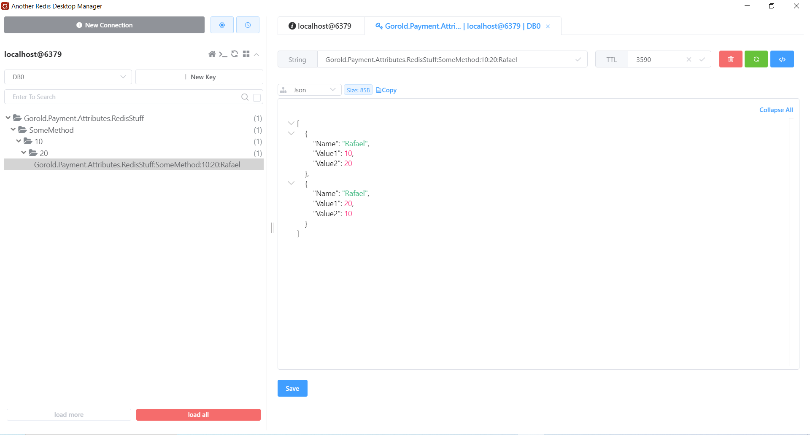

# How keys are generated for our cache

As we have [discussed](../CacheKeyGeneration/CacheKeyGeneration.md) before, we must place our cache attribute on the interface method(s) that we are interested in caching, and all of this action happens on the interface itself.

Cache keys, however, are generated based upon the namespace on which such interface is implemented.

Let's say our interface is:

```csharp
namespace Gorold.Payment.Attributes
{
    public interface IRedisStuff
    {
        [RedisCache]
        List<SomeObject> SomeMethod(int param1, int param2, string name);
    }
}
```

And the implementation lives on:

```csharp
namespace Gorold.Payment.Attributes
{
    public class RedisStuff : IRedisStuff
    {
        public List<SomeObject> SomeMethod(int param1, int param2, string name)
        {
            var list = new List<SomeObject>(){new SomeObject
            {
                Name = name,
                Value1 = param1,
                Value2 = param2
            }, new SomeObject
            {
                Name = name,
                Value1 = param2,
                Value2 = param1
            }};
            return list;
        }
    }
}
```

The cache key generation formula is:

```
namespace.separated.by.dot.with.class.name:method:parameters:separed:by:colon
```

So if we call the method with

- param1 = 10
- param2 = 20
- name = Rafael

We should expect our cache key to be:

- Gorold.Payment.Attributes.RedisStuff:SomeMethod:10:20:Rafael

As you can see, there are two parts you can easily identity: one which is separated by dot (.) and another that is separated by colon (:).

The first section, that is separated by dot (.), corresponds to the namespace until the method we placed the attribute (excluding it).

The second section, that is separated by colon (:), corresponds to the method where the cache attribute has been placed, alongside the values of the attributes that were passed to such method. If no parameters were passed, the cache key would end at _:SomeMethod_.

In the below image, you can find a live example of this happening.


